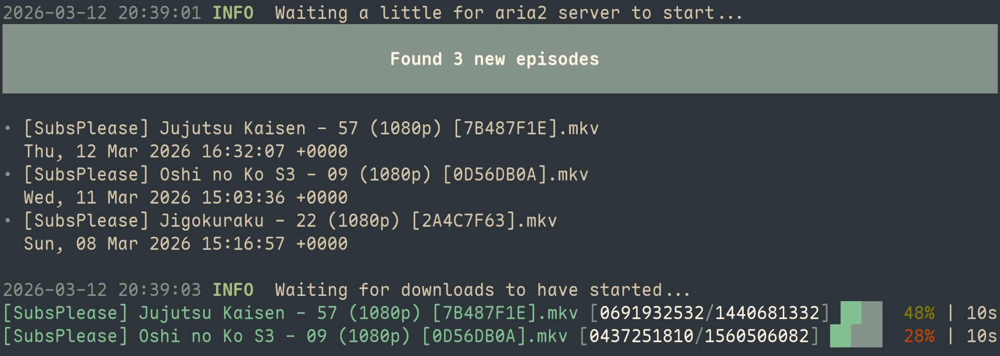

= Anime RSS Download
:toc:

A dead simple https://subsplease.org/ weekly episodes downloader, with almost no features!

.Screenshot of the program in use


== Features

- Uses the RSS 1080p feed to collect new episodes
- Simple "config file" to specify animes to download
- Uses https://aria2.github.io/[aria2] for downloading
- https://pterm.sh/[pterm] for fancy looking download progress

== Installation

=== Using nix flake

```bash
nix run github:niveK77pur/anime-rss-download -- --help
nix run github:niveK77pur/anime-rss-download -- --out-path /where/to/download/episodes
```

=== Using go

You probably only need aria2 available at runtime: https://aria2.github.io/

```bash
go install
```

Will create a binary under

```bash
~/go/bin/anime-rss
```

== Usage

=== What to download?

Under `~/.config/anime-rss` create a text file called `titles`. It should contain a bunch of lines that match the anime title to download from https://subsplease.org. Each line is interpreted as a regex that describes one anime to download.

NOTE: The regex variant is the one from Go's regexp library; for reference on its syntax see: https://pkg.go.dev/regexp/syntax

.Sample config file
====
The following would trigger downloads for these 5 anime:

```bash
❯ cat ~/.config/anime-rss/titles
Jujutsu Kaisen
Fate Strange Fake
Sousou no Frieren
Jigokuraku
Oshi no Ko
```

Note that these don't match the entire title, only a portion of the title is sufficient
====

[IMPORTANT]
====
The lines need to (sub-)match the title in the RSS feed. You can find the titles with the following command (using https://github.com/kislyuk/yq?tab=readme-ov-file#xml-support[`xq`] provided by https://github.com/kislyuk/yq[yq]) to help you figure out what to match:

[source,bash]
----
curl -s 'https://subsplease.org/rss/?r=1080' | xq '.rss.channel.item.[].title'
----

Keep in mind this is an RSS feed of the latest episodes, it will not contain _everything_. This tool here is not a general purpose download utility.
====

=== Download location

As of now, you must *always* provide the `--out-path` argument to specify the download location.

Furthermore, all episodes are downloaded directly into the specified folder. No efforts were made towards downloading episodes into sub-folders according to the `category` of an RSS item; but this could be a simple addition, subject to aria2.

== Details for the curious

=== Aria2

This program launches and manages its own aria2 RPC server to which the main loop sends download requests. This allows using aria2 for downloading (including all its benefits such as magnet links, and resuming downloads), all the while managing our own UI to display download progress through pterm and by quering the aria2 server's status.

=== Slop?

_In this day and age, I feel like this disclaimer may be appreciated..._

After not finding back an older Python RSS downloader I wrote, I decided to make a rewrite with the main intention of having an excuse to use Go again. That said: no! No AI slop! This was all carefully written by hand!

The only area where I don't quite recall if I used AI assistance, was figuring out how to work with the aria2 RPC server. Launching the server was easy, dispatching downloads to the server was easy... but quering the server... I remember it being very difficult to find documentation on what to query exactly to figure out the status of ongoing downloads. I definitely figured out myself that magnet link downloads happen in 2 stages (as you may see when reading through the source code comments), so it is entirely possible that the little AI assistance I used wasn't even all that helpful.
